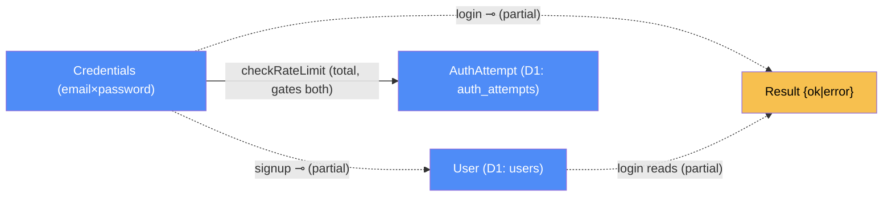

# Auth — categorical model

> Model-first (FRAMEWORK §2/§4). Intended specification for this component; the
> code realises it (see IMPLEMENTATION.md). Source of record: `functions/api/`,
> `schema.sql`, `wrangler.toml`.

## 1. Overview
A lightweight signup/login API for the storefront's header auth panel, added
2026-09-24 as a follow-up to that day's redesign (never logged in a session at
the time — reconciled retroactively in this pass). Cloudflare Pages Functions
(`functions/api/login.js`, `functions/api/signup.js`) back onto a Cloudflare D1
(SQLite) database holding `users` and `auth_attempts`. This is the repo's first
real backend `Loc` — everything in `storefront/` is otherwise a single-`Loc`,
client-only component (§7.1).

## 2. Why
The interesting boundary here isn't the password hashing (standard PBKDF2) —
it's what the API *doesn't* do: a successful login/signup returns only
`{ok, email}`, no token, no cookie, no session. Modeling this explicitly as
"no `Session` `Dat` exists" (§6 below) is the actual value of writing this
model down: it makes precise, checkable, and visible-to-future-readers a fact
that's easy to silently violate by accident (e.g. gating a future feature
behind `localStorage.dodoUserEmail` as if it were verified identity).

## 3. Core category

## 4. Morphism table
| Morphism | Signature | Partiality | Semantics |
| --- | --- | --- | --- |
| `signup` | `Credentials → User ⊸` | Partial | validates email format + 6–200 char password, rate-limited (5/hour/IP), inserts a row; rejects with 409 on duplicate email (DB `UNIQUE` constraint) |
| `login` | `Credentials → 𝔹 ⊸` | Partial | rate-limited (10/60s/IP), looks up by email, re-derives the hash with the stored salt, timing-safe compares; both "no such user" and "wrong password" return the same generic 401 (no user-enumeration leak) |
| `checkRateLimit` | `(key: 𝕊, limit: ℕ, window: ℕ) → 𝔹` | Total | fixed-window counter keyed on `route:ip`, materialised as `AuthAttempt` rows; gates both `signup` and `login` |
| `clientIp` | `Request → 𝕊` | Total | reads `CF-Connecting-IP`; `"unknown"` if absent (Cloudflare-fronted, so this is always present in practice) |

`hashPassword : (password: 𝕊, salt?: 𝕊) → {hash: 𝕊, salt: 𝕊}` and
`timingSafeEqual : (𝕊, 𝕊) → 𝔹` are internal algorithm steps composed *inside*
`signup`/`login` (see §6, rules 1–2) — not independent diagram edges, since
their target is a transient tuple, not a modeled `Dat` object of its own.

## 5. Functors
None. This is the client–server instantiation (§7.2) in its plainest form: two
request/response pairs, no pipeline, no state machine.

## 6. Composition rules
1. `deduction: signup = insert ∘ hashPassword` — the stored `password_hash`/`salt`
   are the output of `hashPassword(password)`, never the raw password (never
   stored, never logged).
2. `deduction: login succeeds iff timingSafeEqual(hashPassword(password, user.salt).hash, user.password_hash)` —
   both the match and no-match branches take the same code path shape (generic
   401), so timing and response shape don't leak which branch was taken.
3. `constraint: users.email` is unique — enforced at the DB (`schema.sql`
   `UNIQUE NOT NULL`), not just checked in application code; `signup` catches
   the DB rejection and returns 409 rather than silently overwriting.
4. `constraint: rate limit` — `checkRateLimit` denies once `count ≥ limit`
   within the fixed window (login: 10/60s/IP; signup: 5/3600s/IP). Fixed-window,
   not sliding — a caller can burst up to `2×limit` requests across a window
   boundary. Documented cost, not a bug; acceptable at this traffic scale.
5. **Note (explicit exception, §6.6):** PBKDF2 runs at 100,000 iterations, below
   OWASP's current 210,000 minimum. Confirmed live that 210k throws
   `"Worker threw exception"` under Cloudflare Pages Functions' per-request CPU
   time limit; 100k is the highest verified-working value on this plan. Raise it
   only after re-testing a real (not short-circuited) login/signup against the
   actual deployment — see `functions/api/_hash.js` comment.

## 7. Atoms owned (FRAMEWORK §4)
**Trn** — the morphism table above (§4); realising code `functions/api/login.js`,
`functions/api/signup.js`, `functions/api/_hash.js`, `functions/api/_ratelimit.js`.
**Loc** — two: the browser tab (shared with `storefront`, the request's origin);
and the Cloudflare Pages Function (Worker) with its bound D1 database
(`dodo_burgers_db`, binding `DB`) — modeled as one `Loc` since the D1 binding
gives the Worker direct addressed access to it, at the granularity that matters
here (FRAMEWORK §4.1).
**Trm** — two, both client↔Worker request/response pairs: `POST /api/signup`
and `POST /api/login`, each carrying `Credentials` on the request and `Result`
on the response. The repo's 2nd and 3rd real `Trm` (after the storefront's
OpenStreetMap embed).
**Placements (§4.2)** — one real case: `validate` (email format, password
length) is placed *twice* — a `TrnLoc` at the browser (`index.html`'s
`required`/`minlength` HTML5 form constraints, UX-only) and a `TrnLoc` at this
component's Worker (`signup.js`'s `EMAIL_RE` + length check, the actual gate).
Textbook §7.2 "validation that runs twice is honest" — not a redundancy to
delete. (`login` has no independent `validate` — it only checks presence, then
defers correctness to the DB lookup + compare.)

## 8. Bridges to other components (ports)
| Boundary morphism | Signature | Stored? | Semantics |
| --- | --- | --- | --- |
| `port_signup` | `storefront.Credentials → auth.User ⊸` | Not stored (effectful call) | `storefront`'s auth-panel form submit (`data-mode="signup"`) calls this over `fetch("/api/signup")` |
| `port_login` | `storefront.Credentials → auth.𝔹 ⊸` | Not stored | `storefront`'s auth-panel form submit (`data-mode="login"`) calls this over `fetch("/api/login")` |

## 9. Coherence notes
Law 1 (placement honesty) holds: `login`/`signup` run entirely at the Worker
`Loc`, reading `password_hash`/`salt` materialised in D1 at that same `Loc`;
the only cross-`Loc` input, `Credentials`, arrives via the request-body `Trm`.
Law 2 (transmission well-typing) holds: both `Trm`s are typed (`carries`) and
cross a real boundary (browser ↔ Worker), materialised at both ends. Law 4
(dependency mediation) is now non-vacuous system-wide — `storefront`'s
`depends-on` edge into `auth` is mediated entirely by `port_signup`/`port_login`;
nothing in `index.html` reaches D1 directly. Law 6 (`runsAt` is a relation) is
also non-vacuous now — see the `validate` placement in §7.

**The law worth restating for future readers** (this component's version of
storefront's "Send to kitchen" note): **no `Session` `Dat` exists.** A
successful `login`/`signup` returns only `{ok, email}` — no token, no cookie,
no signed proof of identity. The client stores that `email` in
`localStorage.dodoUserEmail` purely as a display flag (`setLoggedIn`/
`setLoggedOut` in `index.html`, storefront component). **Nothing currently
gates on it** — the cart, builder, and order flow are all unaffected by login
state, so this is not a live coherence-law violation today. But it means the
"logged in as X" UI is not authentication: any caller can set that
`localStorage` key directly with no server round-trip and appear logged in.
If a future feature needs to actually gate behind identity (saved builds,
order history), it needs a real `Session` `Dat` and a signed `Trm` (cookie or
bearer token) first — do not extend the current flag to authorize anything.
