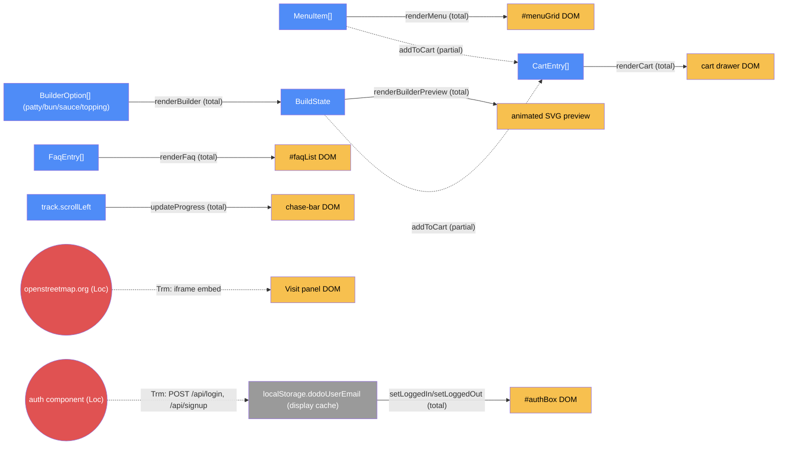

# Storefront — categorical model

> Model-first (FRAMEWORK §2/§4). Intended specification for this component; the
> code realises it (see IMPLEMENTATION.md). Source of record: `index.html`.

## 1. Overview
The entire Dodo Burgers ordering experience: a fixed menu, a photo-driven burger
builder, an FAQ, and an in-memory cart drawer, all rendered client-side from
static data embedded in one file. **2026-09-24**: the page's navigation model
changed from vertical document scroll to a horizontal `.track` of fixed panels
(impeccable-skill redesign; see `PRODUCT.md`/`DESIGN.md`). This added one new,
purely-additive `Trn` family (scroll/track navigation) alongside the original
commerce morphisms below, which are untouched. **Also 2026-09-24** (reconciled
2026-09-25): a header auth panel (log in / sign up / log out) was added,
talking to the new `auth` component over HTTP — see §5c and §8.

## 2. Why
Modeling this as one degenerate component (§7.1: `Loc` collapses to a single
process) makes explicit what's easy to assume otherwise reading the UI copy —
there is no backend, no persistence, and "Send to kitchen" transmits nothing.
The model's main job here is keeping that boundary honest as the site grows.

## 3. Core category

## 4. Morphism table
| Morphism | Signature | Partiality | Semantics |
| --- | --- | --- | --- |
| `renderMenu` | `MenuItem[] → DOM(#menuGrid)` | Total | rebuilds the menu grid from `MENU` on every call |
| `renderBuilder` | `BuilderOption[] × BuildState → DOM(#builder) × total` | Total | rebuilds all four swatch rows and the build-lines list; deduces `total` |
| `renderPillRow` | `BuilderOption[] × BuildState → DOM(swatch row)` | Total | shared renderer for the single-select (patty/bun/sauce) and multi-select (topping) rows |
| `renderBuilderPreview` | `BuildState → SVG` | Total | deduces the animated illustration; diffs against `prevBuildKey` to pick which layer(s) animate |
| `renderFaq` | `FaqEntry[] → DOM(#faqList)` | Total | first entry renders `open` |
| `addToCart` | `CartEntry → CartEntry[]` | Partial | fires only on a menu item's or the builder's "Add to order" click |
| `renderCart` | `CartEntry[] → DOM(cart drawer) × cartTotal` | Total | deduces `cartTotal` from `cart` on every call |
| `money` | `number → string` | Total | `"$" + n.toFixed(2)` |
| `toast` | `string → DOM(#toast)` | Partial | fires only on add/submit/empty-submit actions |

## 5. Functors
One functor of note — the builder pipeline: `BuilderOption[] × click-event →
BuildState → (DOM, SVG)`. No status state machine or strategy resolver exists;
the whole flow is a single render-on-change loop with no server round-trip.

### 5b. Track navigation (added 2026-09-24, second `<script>` block)
A second, independent functor, added by the redesign and never touching the
objects above: `track.scrollLeft → (chase-bar transform, panel visibility)`.
| Morphism | Signature | Partiality | Semantics |
| --- | --- | --- | --- |
| `updateProgress` | `track.scrollLeft × track.scrollWidth → chase-bar --tx × .caught` | Total | deduces chef/dodo/burger X position and the dodo→burger "caught" swap purely from scroll position; nothing about chase state is stored independently |
| `scrollToPanel` | `panel id → track.scrollLeft` | Partial | fires on nav-link/logo click; uses `track.scrollTo({left: el.offsetLeft})` directly — `Element.scrollIntoView` was tried first and found unreliable (lands one panel short) in this nested-scroll/scroll-snap layout |
| wheel handler | `WheelEvent → track.scrollLeft` | Partial | redirects vertical wheel input to horizontal scroll, deferring to a panel's own `.panel-inner` vertical scroll first when that panel doesn't fully fit the viewport |
| keydown handler | `KeyboardEvent → track.scrollBy/scrollTo` | Partial | Arrow/Page/Home/End move one panel or jump to an end |

### 5c. Auth panel (added 2026-09-24, reconciled 2026-09-25, third `<script>` block)
A third, independent functor: the header's auth `
` panel calls the
`auth` component's HTTP API (§8) and caches the result. Never touches the
commerce or track-navigation objects above.
| Morphism | Signature | Partiality | Semantics |
| --- | --- | --- | --- |
| `setLoggedIn` / `setLoggedOut` | `email? → DOM(#authBox)` | Total | toggles the form vs. logout-button visibility and the summary label; pure function of `email?` |
| auth form submit handler | `{mode, email, password} → fetch("/api/"+mode) ⊸` | Partial | fires `port_login`/`port_signup` (auth component, §8); on success writes `localStorage.dodoUserEmail` and calls `setLoggedIn` |
| logout click handler | `() → localStorage.removeItem(...) ⊸` | Partial | clears the cached email and calls `setLoggedOut`; **no server call** — logout is purely local, since no session exists server-side to revoke (see `auth/ARCHITECTURE.md` §9) |

On page load, `localStorage.dodoUserEmail` is read once to decide the initial
`setLoggedIn`/`setLoggedOut` call — this is a display-cache read, not an
authentication check (there is nothing to check against; see §9 below).

## 6. Composition rules
1. `invariant: BuildState.total = patty.price + bun.price + sauce.price + Σ(topping.price)` — enforced in `renderBuilder`.
2. `invariant: cartTotal = Σ(entry.price for entry in cart)` — enforced in `renderCart`.
3. `deduction: renderBuilderPreview's shape/color = f(BuildState, prevBuildKey)` — pure function of current selections plus the diff against the previous state; nothing about the illustration is stored independently of `BuildState`.
4. `deduction: chase-bar dodo/chef/burger position and caught-state = f(track.scrollLeft, track.scrollWidth)` — pure function of scroll position (§5b); no chase-progress value is stored outside the scroll position itself.
5. `constraint: localStorage.dodoUserEmail` (§5c) is a cache of the `auth` component's last successful response, never independently derived or guessed — written only inside the fetch `.then()` success branch, cleared only by explicit logout.

## 7. Atoms owned (FRAMEWORK §4)
**Trn** — the commerce morphism table (§4) plus the track-navigation morphisms (§5b) and the auth-panel morphisms (§5c); realising code `index.html:<script>` (commerce IIFE), `index.html`'s second `<script>` (navigation), and third `<script>` (auth panel).
**Loc** — three, as of 2026-09-24: the browser tab rendering the page (still the only `Loc` for every commerce morphism, collapsed per §7.1); `openstreetmap.org`'s tile/embed server, reached only by the "Find the shop" panel's `<iframe>`; and the `auth` component's Cloudflare Worker, reached only by the auth-panel form submit (§5c, §8).
**Trm** — three real ones, as of 2026-09-24: the OpenStreetMap `<iframe src="https://www.openstreetmap.org/export/embed.html?...">` in the Visit panel (one-way, read-only map tiles); and `POST /api/login` / `POST /api/signup` (§8) — request/response pairs to the `auth` component. The address/hours text in the Visit panel is realised independently of the map `Trm` so the panel stays meaningful if it fails (see Law 1 note below); the auth panel similarly degrades to its error message on fetch failure (`"Network error — is the API deployed?"`) rather than hanging. Every other handoff (click → state mutation → re-render, including the chase-bar and cart) is still same-`Loc`, i.e. `Trn`, not `Trm`. "Send to kitchen" is still a same-`Loc` state reset (`cart = []`), never a network call.
**Placements (§4.2)** — one, added 2026-09-24: `User.email` (owned by `auth`) is materialised at two `DataLoc`s — authoritative at `auth`'s D1 `users` table, and a display-only copy at `storefront`'s `localStorage.dodoUserEmail` — see `docs/architecture-map.md` §4 for the system-level statement (this is a cross-component placement, so the canonical record lives at the system level, not duplicated here).

## 8. Bridges to other components (ports)
| Boundary morphism | Signature | Stored? | Semantics |
| --- | --- | --- | --- |
| calls `auth.port_signup` | `{email,password} → auth.User ⊸` | Not stored locally beyond the cached `email` on success | fired by the auth-panel form submit (§5c) with `data-mode="signup"` |
| calls `auth.port_login` | `{email,password} → auth.𝔹 ⊸` | Not stored locally beyond the cached `email` on success | fired by the auth-panel form submit (§5c) with `data-mode="login"` |

## 9. Coherence notes
Law 6 (runsAt is a relation) is satisfied but no longer vacuous system-wide —
see `auth/ARCHITECTURE.md` §7 for the `validate` double-placement (browser +
Worker); nothing in `storefront` itself is placed twice. Law 2 (transmission
well-typing) covers all three real `Trm`s now: the OpenStreetMap embed (§7)
carries only map-tile imagery and asserts nothing about the site's own `Dat`;
the two auth `Trm`s each carry a typed `Credentials`/`Result` pair, materialised
at both ends (`index.html`'s in-memory form state ↔ the Worker's request
handling). Law 4 (dependency mediation) is now non-vacuous: `storefront`
`depends-on` `auth`, mediated entirely by the two `port_*` calls in §8 — no
direct reach into D1. The law worth restating for future readers is still Law
1 (placement honesty): the UI must never imply the order reaches a real
kitchen. `toast("Order sent to the kitchen — thank you!")` is intentional
fiction matching the site's tone — a future change adding real ordering would
need a genuine `Trm` here, not just new copy (exactly the kind the map and the
auth API now demonstrate the shape of). **A second, new placement-honesty
note:** the auth panel's "logged in as X" label must never be read by future
code as proof of identity — it is a `DataLoc` copy (§7), not a session; see
`auth/ARCHITECTURE.md` §9 for the full statement of that gap.
