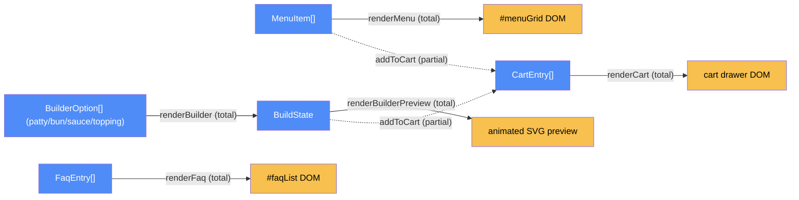

# Storefront — categorical model

> Model-first (FRAMEWORK §2/§4). Intended specification for this component; the
> code realises it (see IMPLEMENTATION.md). Source of record: `index.html`.

## 1. Overview
The entire Dodo Burgers ordering experience: a fixed menu, a photo-driven burger
builder, an FAQ, and an in-memory cart drawer, all rendered client-side from
static data embedded in one file.

## 2. Why
Modeling this as one degenerate component (§7.1: `Loc` collapses to a single
process) makes explicit what's easy to assume otherwise reading the UI copy —
there is no backend, no persistence, and "Send to kitchen" transmits nothing.
The model's main job here is keeping that boundary honest as the site grows.

## 3. Core category

## 4. Morphism table
| Morphism | Signature | Partiality | Semantics |
| --- | --- | --- | --- |
| `renderMenu` | `MenuItem[] → DOM(#menuGrid)` | Total | rebuilds the menu grid from `MENU` on every call |
| `renderBuilder` | `BuilderOption[] × BuildState → DOM(#builder) × total` | Total | rebuilds all four swatch rows and the build-lines list; deduces `total` |
| `renderPillRow` | `BuilderOption[] × BuildState → DOM(swatch row)` | Total | shared renderer for the single-select (patty/bun/sauce) and multi-select (topping) rows |
| `renderBuilderPreview` | `BuildState → SVG` | Total | deduces the animated illustration; diffs against `prevBuildKey` to pick which layer(s) animate |
| `renderFaq` | `FaqEntry[] → DOM(#faqList)` | Total | first entry renders `open` |
| `addToCart` | `CartEntry → CartEntry[]` | Partial | fires only on a menu item's or the builder's "Add to order" click |
| `renderCart` | `CartEntry[] → DOM(cart drawer) × cartTotal` | Total | deduces `cartTotal` from `cart` on every call |
| `money` | `number → string` | Total | `"$" + n.toFixed(2)` |
| `toast` | `string → DOM(#toast)` | Partial | fires only on add/submit/empty-submit actions |

## 5. Functors
One functor of note — the builder pipeline: `BuilderOption[] × click-event →
BuildState → (DOM, SVG)`. No status state machine or strategy resolver exists;
the whole flow is a single render-on-change loop with no server round-trip.

## 6. Composition rules
1. `invariant: BuildState.total = patty.price + bun.price + sauce.price + Σ(topping.price)` — enforced in `renderBuilder`.
2. `invariant: cartTotal = Σ(entry.price for entry in cart)` — enforced in `renderCart`.
3. `deduction: renderBuilderPreview's shape/color = f(BuildState, prevBuildKey)` — pure function of current selections plus the diff against the previous state; nothing about the illustration is stored independently of `BuildState`.

## 7. Atoms owned (FRAMEWORK §4)
**Trn** — the full morphism table above; realising code `index.html:<script>` (single IIFE).
**Loc** — one: the browser tab rendering the page. Collapsed to one process — Dat+Alg (§7.1); no server-side `Loc` exists.
**Trm** — none. Every handoff (click → state mutation → re-render) is same-`Loc`, i.e. `Trn`, not `Trm`. "Send to kitchen" is a same-`Loc` state reset (`cart = []`), never a network call.
**Placements (§4.2)** — none; nothing here runs in more than one place.

## 8. Bridges to other components (ports)
None — this is the only component in the repo.

## 9. Coherence notes
Law 2 (transmission well-typing) and Law 6 (runsAt is a relation) are vacuously
satisfied — there is no `Trm` and no multi-`Loc` placement to check. The one law
worth restating for future readers is Law 1 (placement honesty): the UI must
never imply the order reaches a real kitchen. `toast("Order sent to the kitchen
— thank you!")` is intentional fiction matching the site's tone — but a future
change adding real ordering would need a genuine `Trm` here, not just new copy.
